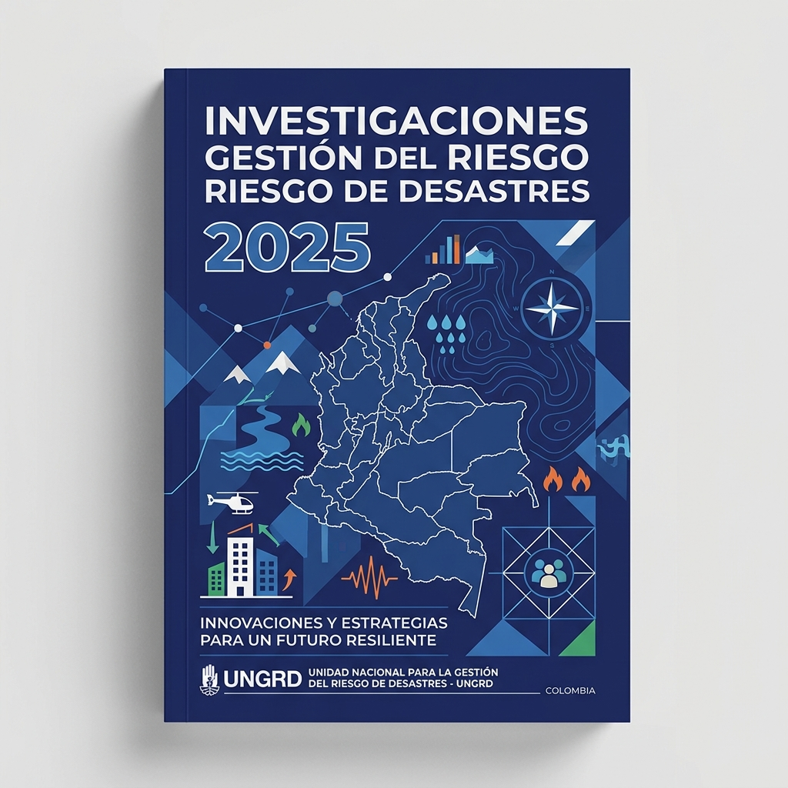
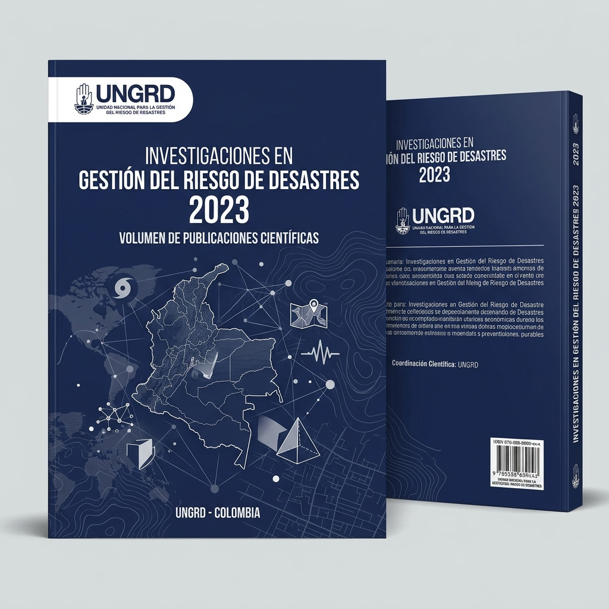
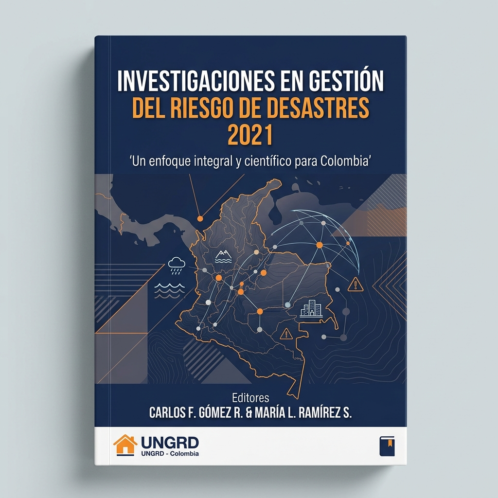
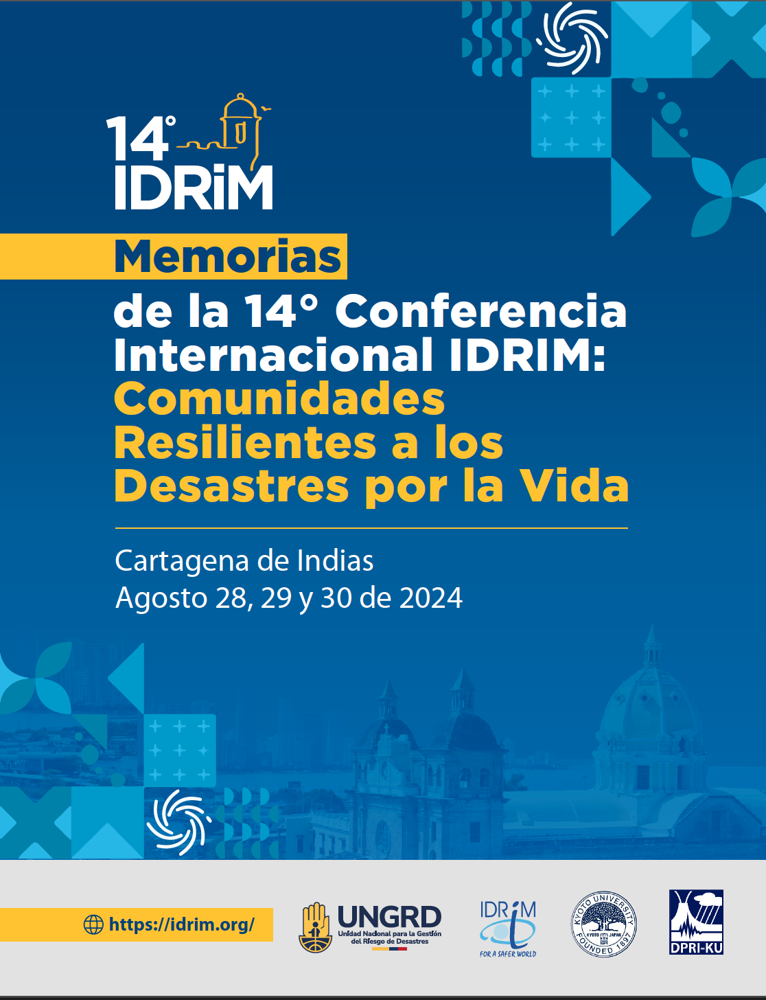

```{=html}
<style>#title-block-header { display: none !important; }</style>

<!-- ══════════════════════════════════════════════════════
     HERO
     ══════════════════════════════════════════════════════ -->
<section class="hero-portal">
  <div class="hero-portal__left">
    <div class="hero-portal__badge">
      <i class="bi bi-book-fill"></i>
      Colección Científica · UNGRD
    </div>
    <h1 class="hero-portal__title">
      Investigaciones en Gestión del<br>
      <em>Riesgo de Desastres</em>
    </h1>
    <p class="hero-portal__description">
      Serie de publicaciones técnicas y científicas elaboradas por la
      <strong>Subdirección de Conocimiento del Riesgo de la UNGRD</strong>,
      que consolidan el conocimiento sobre escenarios de riesgo, vulnerabilidad
      y capacidad institucional para la gestión del riesgo en Colombia.
    </p>
    <a href="#publicaciones" class="hero-portal__cta">
      Ver publicaciones <i class="bi bi-arrow-down-short"></i>
    </a>
  </div>

  <div class="hero-portal__right">
    <div class="hero-stats-panel">
      <div class="hero-stat">
        <span class="hero-stat__number">3</span>
        <span class="hero-stat__label">Libros publicados</span>
      </div>
      <div class="hero-stat">
        <span class="hero-stat__number">2021</span>
        <span class="hero-stat__label">Primer volumen</span>
      </div>
      <div class="hero-stat">
        <span class="hero-stat__number">2025</span>
        <span class="hero-stat__label">Edición más reciente</span>
      </div>
      <div class="hero-stat">
        <span class="hero-stat__number">5+</span>
        <span class="hero-stat__label">Temas investigados</span>
      </div>
    </div>
  </div>
</section>

<!-- ══════════════════════════════════════════════════════
     MARCO INVESTIGATIVO
     ══════════════════════════════════════════════════════ -->
<div id="marco" class="section-wrapper">
  <div class="section-header">
    <span class="section-label">Marco investigativo</span>
    <h2 class="section-title">Sobre la colección</h2>
    <div class="section-divider"></div>
  </div>
  <p class="marco-intro">
    Las <strong>Investigaciones en Gestión del Riesgo de Desastres</strong> son
    publicaciones científicas y técnicas elaboradas por la Subdirección de Conocimiento
    del Riesgo de la UNGRD, que reúnen avances en el estudio de amenazas naturales,
    vulnerabilidad territorial, capacidades institucionales y estrategias de reducción
    del riesgo en Colombia.
  </p>
  <div class="marco-steps">
    <div class="step-card">
      <div class="step-card__number">1</div>
      <p class="step-card__title">Análisis de Amenazas</p>
      <p class="step-card__text">Estudio técnico de fenómenos naturales como inundaciones, sismos, movimientos en masa y sequías a escala nacional y departamental.</p>
    </div>
    <div class="step-card">
      <div class="step-card__number">2</div>
      <p class="step-card__title">Vulnerabilidad Territorial</p>
      <p class="step-card__text">Caracterización de la exposición y las condiciones de vulnerabilidad de la población y la infraestructura frente a múltiples amenazas.</p>
    </div>
    <div class="step-card">
      <div class="step-card__number">3</div>
      <p class="step-card__title">Capacidad Institucional</p>
      <p class="step-card__text">Evaluación de los sistemas nacionales y territoriales de gestión del riesgo, incluyendo el SNGRD y los planes departamentales.</p>
    </div>
    <div class="step-card">
      <div class="step-card__number">4</div>
      <p class="step-card__title">Reducción del Riesgo</p>
      <p class="step-card__text">Propuestas y estrategias de intervención para reducir el riesgo existente y evitar la generación de nuevos escenarios en el territorio.</p>
    </div>
  </div>
</div>

<!-- ══════════════════════════════════════════════════════
     PUBLICACIONES ACADÉMICAS
     ══════════════════════════════════════════════════════ -->
<div class="section-alt">
  <div id="publicaciones" class="section-wrapper">
    <div class="section-header">
      <span class="section-label">Publicaciones académicas</span>
      <h2 class="section-title">Libros de Investigación</h2>
      <p class="section-subtitle">
        Análisis técnicos, metodologías y estudios sobre gestión del riesgo de desastres.
      </p>
      <div class="section-divider"></div>
    </div>

    <div class="libros-grid">

      <!-- ── 2025 ── -->
      <a class="libro-card"
         href="https://scr-ungrd.github.io/investigaciones-grd-2025/"
         target="_blank">
        <div class="card">
          
          <div class="card-body">
            <h5 class="card-title">Investigaciones en GRD 2025</h5>
            <p class="card-text">Análisis técnicos y metodológicos sobre gestión del riesgo de desastres en Colombia.</p>
          </div>
        </div>
      </a>

      <!-- ── 2023 ── -->
      <a class="libro-card"
         href="https://scr-ungrd.github.io/investigaciones-grd-2023/"
         target="_blank">
        <div class="card">
          
          <div class="card-body">
            <h5 class="card-title">Investigaciones en GRD 2023</h5>
            <p class="card-text">Estudios sobre vulnerabilidad territorial, amenazas naturales y capacidades institucionales en Colombia.</p>
          </div>
        </div>
      </a>

      <!-- ── 2021 ── -->
      <a class="libro-card"
         href="https://scr-ungrd.github.io/investigaciones-grd-2021/"
         target="_blank">
        <div class="card">
          
          <div class="card-body">
            <h5 class="card-title">Investigaciones en GRD 2021</h5>
            <p class="card-text">Primer volumen de la serie, con análisis de escenarios de riesgo y lineamientos para la planificación territorial.</p>
          </div>
        </div>
      </a>

    </div>
  </div>
</div>

<!-- ══════════════════════════════════════════════════════
     OTRAS PUBLICACIONES
     ══════════════════════════════════════════════════════ -->
<div class="section-wrapper">
  <div id="otras" class="section-header">
    <span class="section-label">Otras publicaciones</span>
    <h2 class="section-title">Memorias y eventos técnicos</h2>
    <p class="section-subtitle">
      Documentos derivados de conferencias y eventos académicos en gestión del riesgo.
    </p>
    <div class="section-divider"></div>
  </div>

  <div class="otras-grid">

    <!-- ── IDRIM 2024 ── -->
    <a class="otra-card"
       href="https://scr-ungrd.github.io/memorias-idrim-2024-colombia/"
       target="_blank">
      <div class="card">
        
        <div class="card-body">
          <h5 class="card-title">Memorias IDRIM 2024</h5>
          <p class="card-text">14° Conferencia Internacional sobre Gestión Integrada del Riesgo de Desastres. Bogotá, Colombia, agosto 2024.</p>
        </div>
      </div>
    </a>

  </div>
</div>
```
