```{=html}
<style>#title-block-header { display: none !important; }</style>

<!-- ══════════════════════════════════════════════════════
     HERO SECTION (COLECCIÓN)
     ══════════════════════════════════════════════════════ -->
<section id="serie" class="nature-hero-section">
  <div class="nature-hero-container">
    <div class="nature-hero-content">
      <div class="nature-hero-badge">Colección Científica · UNGRD</div>
      <h1 class="nature-hero-title">Investigaciones en Gestión del Riesgo de Desastres para Colombia</h1>
      <p class="nature-hero-description">
        Serie de libros de investigación elaborados por la <strong>Subdirección para el Conocimiento del Riesgo y la Comisión Asesora para el Fomento de la Ciencia, Tecnología e Innovación en Gestión del Riesgo</strong>. Esta colección compila nuevo conocimiento sobre los procesos de la gestión del riesgo de desastres en Colombia.
      </p>
      <div class="nature-hero-stats">
        <div class="stat-item">
          <span class="stat-num">3</span>
          <span class="stat-label">Volúmenes Publicados</span>
        </div>
        <div class="stat-item">
          <span class="stat-num">34</span>
          <span class="stat-label">Capítulos de Investigación</span>
        </div>
      </div>
    </div>
    
    <div class="nature-hero-visual">
      <div class="cover-stack">
        <a href="https://scr-ungrd.github.io/investigaciones-grd-2025/" target="_blank" class="cover-link">
          
          <span class="cover-year">2025</span>
        </a>
        <a href="https://scr-ungrd.github.io/investigaciones-grd-2023/" target="_blank" class="cover-link">
          
          <span class="cover-year">2023</span>
        </a>
        <a href="https://scr-ungrd.github.io/investigaciones-grd-2021/" target="_blank" class="cover-link">
          
          <span class="cover-year">2021</span>
        </a>
      </div>
    </div>
  </div>
</section>

<!-- ══════════════════════════════════════════════════════
     CAPÍTULOS
     ══════════════════════════════════════════════════════ -->
<section id="capitulos" class="chapters-section">
  <div class="chapters-container">
    <div class="section-header">
      <h2 class="section-title">Contenido de la serie</h2>
      <div class="section-divider"></div>
    </div>

    <!-- LIBRO 2025 -->
    <div class="book-group">
      <h3 class="book-group-title">Enfoque Comunitario, Territorial y Animal (2025)</h3>
      <div class="chapters-grid">
        <!-- Card Capítulo 1 -->
        <a href="https://scr-ungrd.github.io/investigaciones-grd-2025/Capitulo1.html" target="_blank" class="chapter-card">
          <div class="chapter-card-image">
            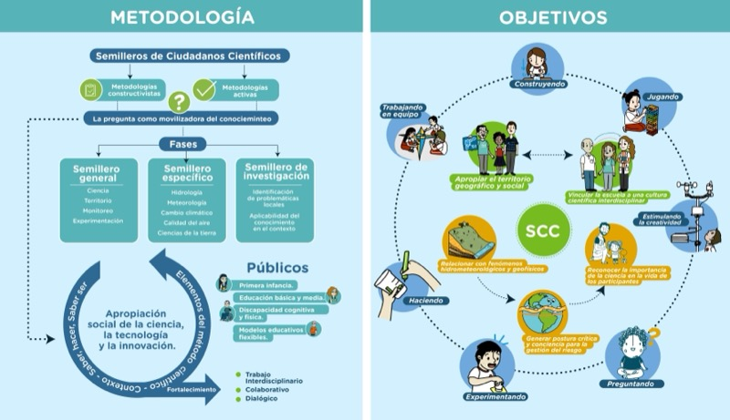
          </div>
          <div class="chapter-card-content">
            <span class="chapter-tag">Volumen 2025 · Capítulo 1</span>
            <h4 class="chapter-title">Entre el conocimiento y la acción: estrategias para la gestión del riesgo de desastres y la adaptación climática en el Valle de Aburrá</h4>
          </div>
        </a>
        
        <!-- Card Capítulo 2 -->
        <a href="https://scr-ungrd.github.io/investigaciones-grd-2025/Capitulo2.html" target="_blank" class="chapter-card">
          <div class="chapter-card-image">
            
          </div>
          <div class="chapter-card-content">
            <span class="chapter-tag">Volumen 2025 · Capítulo 2</span>
            <h4 class="chapter-title">Enfoque etnodiferencial y riesgo de desastre en Colombia: líneas de fuga para una digna vida</h4>
          </div>
        </a>
        
        <!-- Card Capítulo 3 -->
        <a href="https://scr-ungrd.github.io/investigaciones-grd-2025/Capitulo3.html" target="_blank" class="chapter-card">
          <div class="chapter-card-image">
            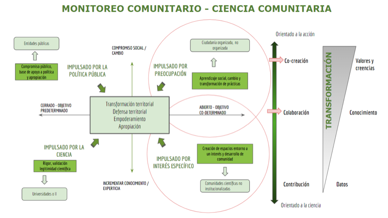
          </div>
          <div class="chapter-card-content">
            <span class="chapter-tag">Volumen 2025 · Capítulo 3</span>
            <h4 class="chapter-title">Gestión del Riesgo de Desastres Comunitario a través de Cartografía Participativa y Tecnologías Abiertas en San Antonio del Prado</h4>
          </div>
        </a>
        
        <!-- Card Capítulo 4 -->
        <a href="https://scr-ungrd.github.io/investigaciones-grd-2025/Capitulo4.html" target="_blank" class="chapter-card">
          <div class="chapter-card-image">
            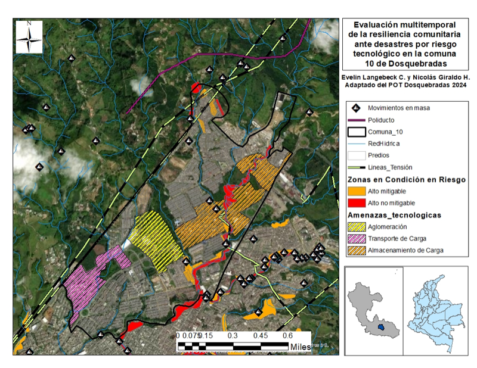
          </div>
          <div class="chapter-card-content">
            <span class="chapter-tag">Volumen 2025 · Capítulo 4</span>
            <h4 class="chapter-title">Evaluación multitemporal de la resiliencia comunitaria ante eventos tecnológicos en la Comuna 10 de Dosquebradas</h4>
          </div>
        </a>
        
        <!-- Card Capítulo 5 -->
        <a href="https://scr-ungrd.github.io/investigaciones-grd-2025/Capitulo5.html" target="_blank" class="chapter-card">
          <div class="chapter-card-image">
            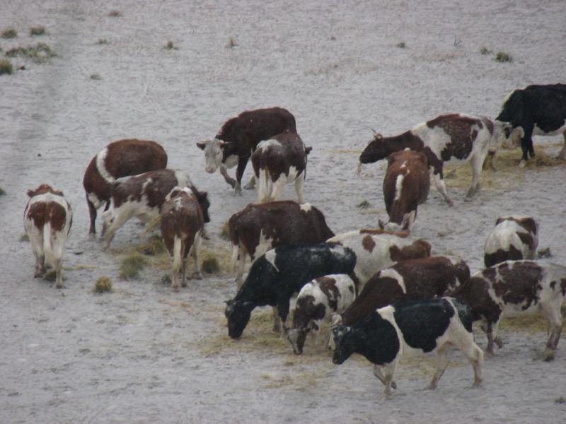
          </div>
          <div class="chapter-card-content">
            <span class="chapter-tag">Volumen 2025 · Capítulo 5</span>
            <h4 class="chapter-title">Avances y desafíos del manejo de desastres y gestión del riesgo volcánico con animales de producción</h4>
          </div>
        </a>
      </div>
    </div>

    <!-- LIBRO 2023 -->
    <div class="book-group mt-5">
      <h3 class="book-group-title">Contribuciones locales, regionales y nacionales (2023)</h3>
      <div class="chapters-grid">
        <!-- Card Capítulo 1 -->
        <a href="https://scr-ungrd.github.io/investigaciones-grd-2023/01-c01-lgrd-14-calidad-agua-vf-2022-08-17.html" target="_blank" class="chapter-card">
          <div class="chapter-card-image">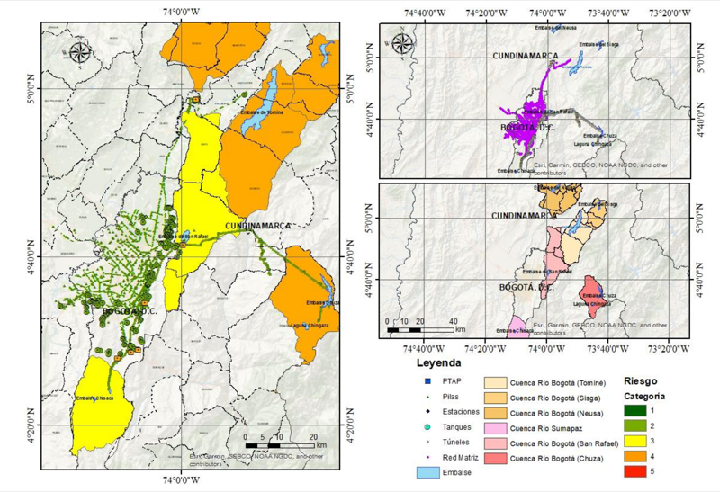</div>
          <div class="chapter-card-content">
            <span class="chapter-tag">Volumen 2023 · Capítulo 1</span>
            <h4 class="chapter-title">Evaluación indicativa del riesgo a la calidad del agua frente a amenazas naturales y antrópicas: el caso de Bogotá</h4>
          </div>
        </a>
        <!-- Card Capítulo 2 -->
        <a href="https://scr-ungrd.github.io/investigaciones-grd-2023/02-c02-lgrd-16-evaluacion-amenaza-tsunami_vf-202.html" target="_blank" class="chapter-card">
          <div class="chapter-card-image">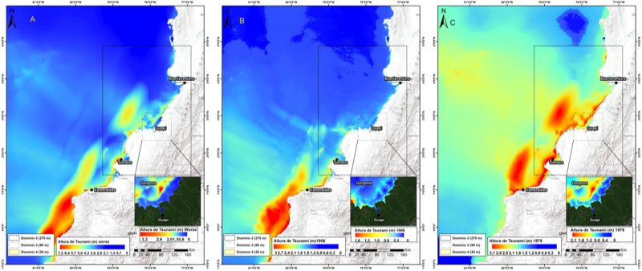</div>
          <div class="chapter-card-content">
            <span class="chapter-tag">Volumen 2023 · Capítulo 2</span>
            <h4 class="chapter-title">Evaluación de la amenaza por tsunami en el litoral Pacífico colombiano: Caso de estudio Guapi, Departamento del Cauca</h4>
          </div>
        </a>
        <!-- Card Capítulo 3 -->
        <a href="https://scr-ungrd.github.io/investigaciones-grd-2023/03-c3-lgrd-27-multiamenaza-corredores-vialesvf20.html" target="_blank" class="chapter-card">
          <div class="chapter-card-image">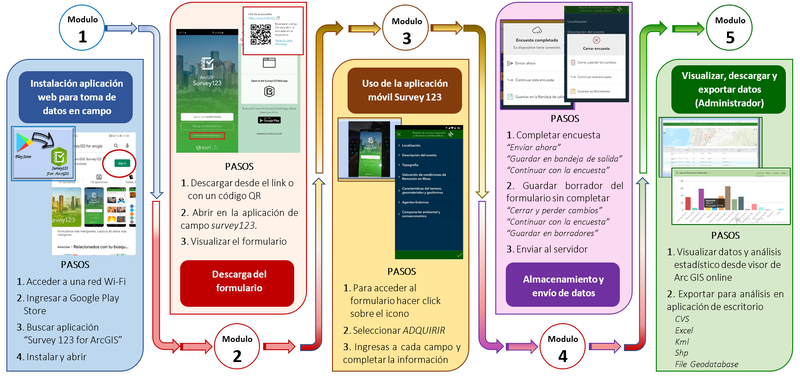</div>
          <div class="chapter-card-content">
            <span class="chapter-tag">Volumen 2023 · Capítulo 3</span>
            <h4 class="chapter-title">Metodología para captura de datos y caracterización en estudios de valoración cualitativa multiamenaza en corredores viales apoyada en TIC</h4>
          </div>
        </a>
        <!-- Card Capítulo 4 -->
        <a href="https://scr-ungrd.github.io/investigaciones-grd-2023/04-c04-lgrd-15-avenidas-torrenciales-antioquia_v.html" target="_blank" class="chapter-card">
          <div class="chapter-card-image">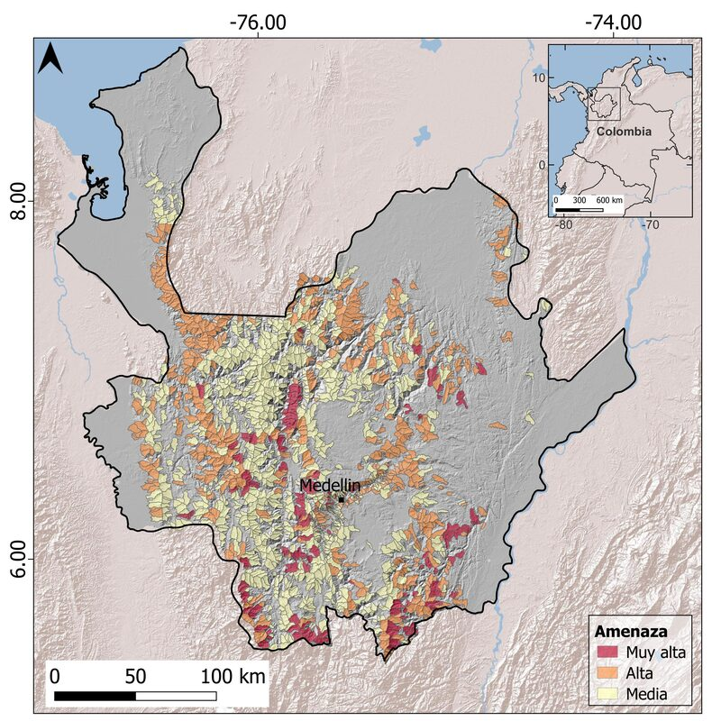</div>
          <div class="chapter-card-content">
            <span class="chapter-tag">Volumen 2023 · Capítulo 4</span>
            <h4 class="chapter-title">Evaluación de la amenaza por avenidas torrenciales en el departamento de Antioquia a escala de cuenca</h4>
          </div>
        </a>
        <!-- Card Capítulo 5 -->
        <a href="https://scr-ungrd.github.io/investigaciones-grd-2023/05-c5-lgrd-12-incendios-orinoquiavf-2022-09-26.html" target="_blank" class="chapter-card">
          <div class="chapter-card-image">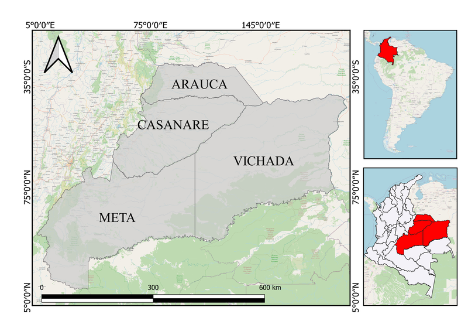</div>
          <div class="chapter-card-content">
            <span class="chapter-tag">Volumen 2023 · Capítulo 5</span>
            <h4 class="chapter-title">Comparativo de incendios forestales en Colombia a través de instrumentos de teledetección: caso de estudio en la región de la Orinoquía</h4>
          </div>
        </a>
        <!-- Card Capítulo 6 -->
        <a href="https://scr-ungrd.github.io/investigaciones-grd-2023/06-c06-lgrd-23-riesgo-inundacion-mojana-vf-2022-.html" target="_blank" class="chapter-card">
          <div class="chapter-card-image">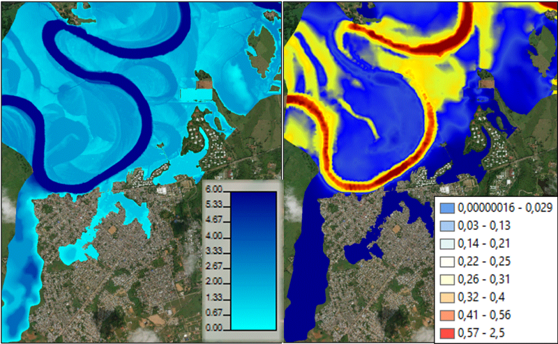</div>
          <div class="chapter-card-content">
            <span class="chapter-tag">Volumen 2023 · Capítulo 6</span>
            <h4 class="chapter-title">Usos de la evaluación integral del riesgo por inundación en la consolidación de comunidades resilientes: caso de estudio en cabeceras municipales de la ecorregión de la Mojana</h4>
          </div>
        </a>
        <!-- Card Capítulo 7 -->
        <a href="https://scr-ungrd.github.io/investigaciones-grd-2023/07-c07-lgrd-07-desastres-armero-mocoavf-2022-09-.html" target="_blank" class="chapter-card">
          <div class="chapter-card-image">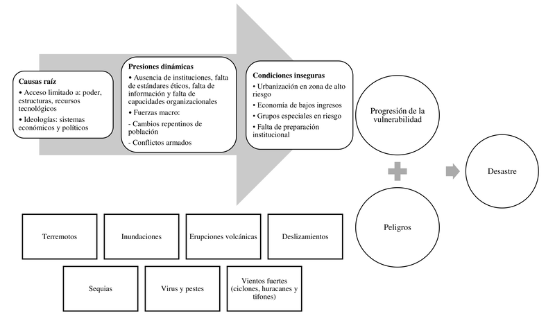</div>
          <div class="chapter-card-content">
            <span class="chapter-tag">Volumen 2023 · Capítulo 7</span>
            <h4 class="chapter-title">Análisis de los desastres de Armero 1985 y Mocoa 2017 en Colombia utilizando el modelo Pressure and Release</h4>
          </div>
        </a>
        <!-- Card Capítulo 8 -->
        <a href="https://scr-ungrd.github.io/investigaciones-grd-2023/08-c08-lgrd-20-percepcion-del-riesgovf-2-2022-08.html" target="_blank" class="chapter-card">
          <div class="chapter-card-image">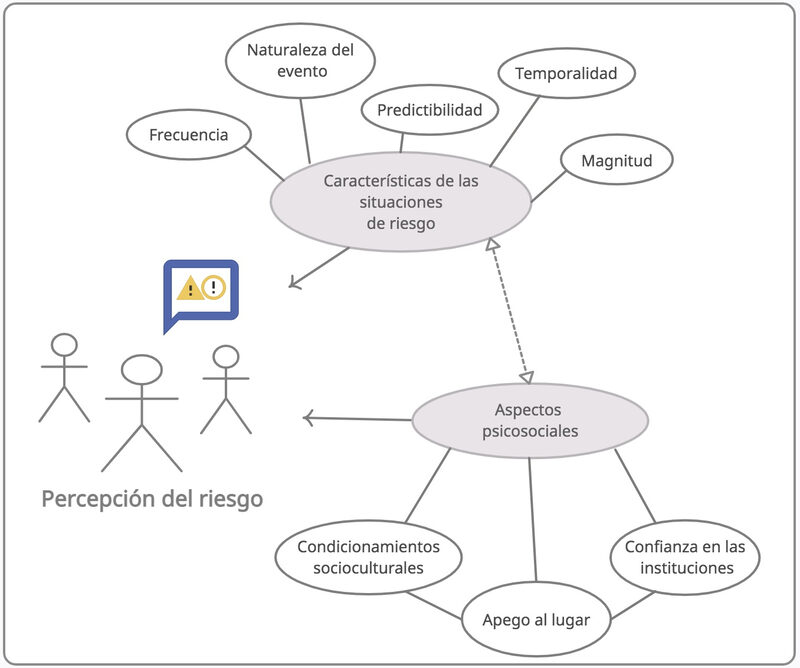</div>
          <div class="chapter-card-content">
            <span class="chapter-tag">Volumen 2023 · Capítulo 8</span>
            <h4 class="chapter-title">Imbricación cultural, espacial y psicosocial en la percepción del riesgo de desastres. Reflexiones sobre casos de estudio en Colombia</h4>
          </div>
        </a>
        <!-- Card Capítulo 9 -->
        <a href="https://scr-ungrd.github.io/investigaciones-grd-2023/09-c9-lgrd-18-mirada-diferencial-comunidad-vf-20.html" target="_blank" class="chapter-card">
          <div class="chapter-card-image">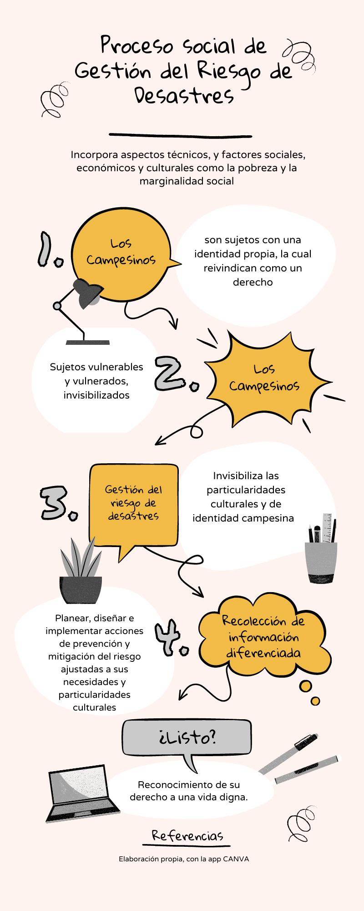</div>
          <div class="chapter-card-content">
            <span class="chapter-tag">Volumen 2023 · Capítulo 9</span>
            <h4 class="chapter-title">Gestión del riesgo de desastres en Colombia: una mirada diferencial para los campesinos y su vida digna</h4>
          </div>
        </a>
        <!-- Card Capítulo 10 -->
        <a href="https://scr-ungrd.github.io/investigaciones-grd-2023/10-c10-lgrd-19-sistema-control-riesgo-sismico-vf.html" target="_blank" class="chapter-card">
          <div class="chapter-card-image">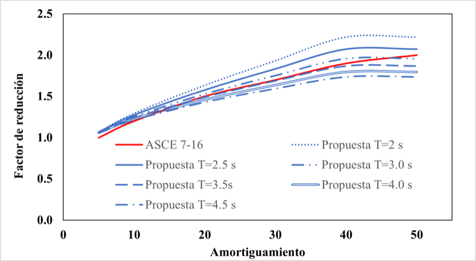</div>
          <div class="chapter-card-content">
            <span class="chapter-tag">Volumen 2023 · Capítulo 10</span>
            <h4 class="chapter-title">Sistemas de control de respuesta estructural para la mitigación del riesgo sísmico en la infraestructura colombiana. Necesidad inmediata de una normativa para el país</h4>
          </div>
        </a>
        <!-- Card Capítulo 11 -->
        <a href="https://scr-ungrd.github.io/investigaciones-grd-2023/11-c11-lgrd-06-gestion-integral-biodiversidadv6-.html" target="_blank" class="chapter-card">
          <div class="chapter-card-image">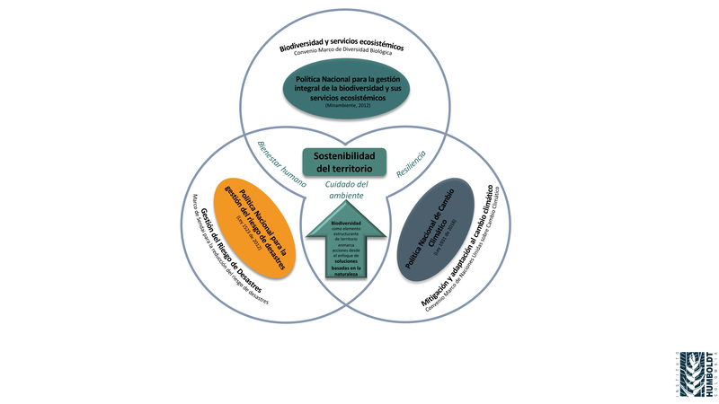</div>
          <div class="chapter-card-content">
            <span class="chapter-tag">Volumen 2023 · Capítulo 11</span>
            <h4 class="chapter-title">La gestión integral de la biodiversidad y sus servicios ecosistémicos para la gestión del riesgo y el cambio climático</h4>
          </div>
        </a>
        <!-- Card Capítulo 12 -->
        <a href="https://scr-ungrd.github.io/investigaciones-grd-2023/12-c12-lgrd-21-retos-eco-drr-y-sbn-vf-2022-18-08.html" target="_blank" class="chapter-card">
          <div class="chapter-card-image">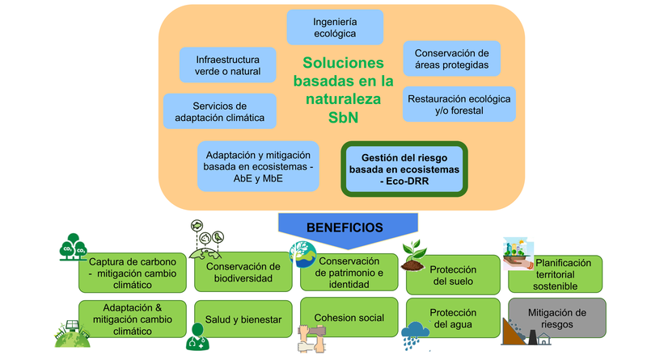</div>
          <div class="chapter-card-content">
            <span class="chapter-tag">Volumen 2023 · Capítulo 12</span>
            <h4 class="chapter-title">Retos para incorporar las soluciones basadas en la naturaleza y la reducción del riesgo de desastres con enfoque ecosistémico en la planificación territorial de Colombia</h4>
          </div>
        </a>
        <!-- Card Capítulo 13 -->
        <a href="https://scr-ungrd.github.io/investigaciones-grd-2023/13-c13-lgrd-10-biotratamiento-suelo-quema-19-09-.html" target="_blank" class="chapter-card">
          <div class="chapter-card-image">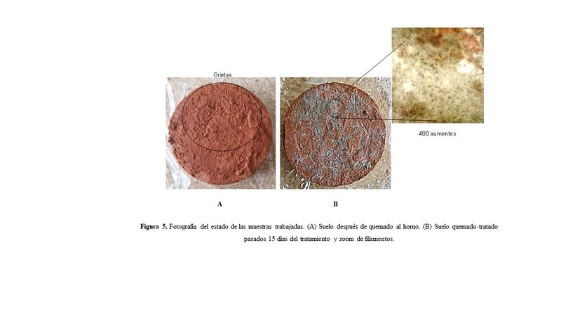</div>
          <div class="chapter-card-content">
            <span class="chapter-tag">Volumen 2023 · Capítulo 13</span>
            <h4 class="chapter-title">Biomineralización como herramienta en la recuperación de las propiedades de un suelo residual compactado sometido a quema</h4>
          </div>
        </a>
        <!-- Card Capítulo 14 -->
        <a href="https://scr-ungrd.github.io/investigaciones-grd-2023/14-c14-lgrd-03-gestion-del-riesgo-en-salud-vf-v4.html" target="_blank" class="chapter-card">
          <div class="chapter-card-image">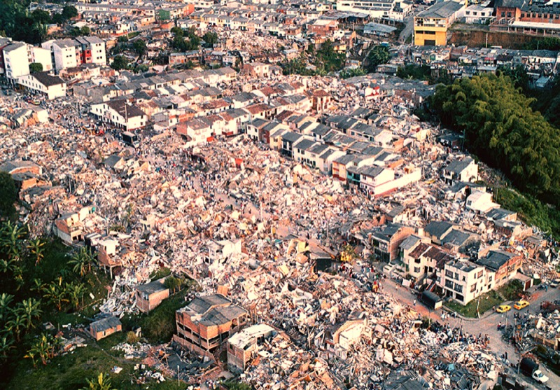</div>
          <div class="chapter-card-content">
            <span class="chapter-tag">Volumen 2023 · Capítulo 14</span>
            <h4 class="chapter-title">Gestión del riesgo en salud en situación de desastres. Lecciones aprendidas en Armenia</h4>
          </div>
        </a>
        <!-- Card Capítulo 15 -->
        <a href="https://scr-ungrd.github.io/investigaciones-grd-2023/15-c-15-lgrd-11-preparacion-de-respondedores-vf3.html" target="_blank" class="chapter-card">
          <div class="chapter-card-image">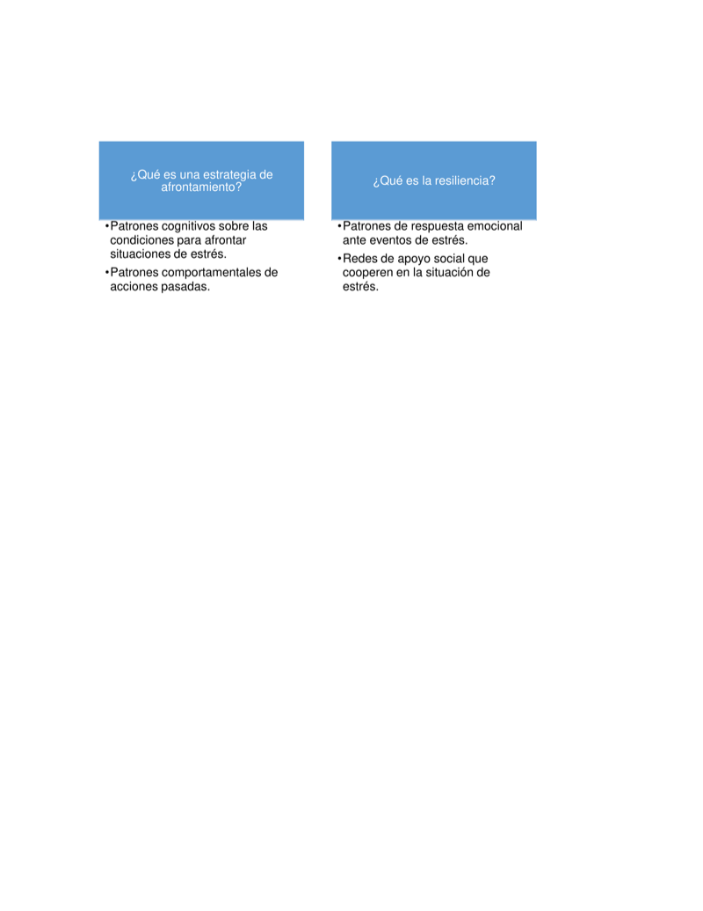</div>
          <div class="chapter-card-content">
            <span class="chapter-tag">Volumen 2023 · Capítulo 15</span>
            <h4 class="chapter-title">Preparación de respondedores de emergencias en el Quindío: un estudio sobre los estilos de afrontamiento y factores de resiliencia en un grupo de bomberos voluntarios</h4>
          </div>
        </a>
      </div>
    </div>

    <!-- LIBRO 2021 -->
    <div class="book-group mt-5">
      <h3 class="book-group-title">Avances, perspectivas y casos de estudio (2021) </h3>
      <div class="chapters-grid">
        <!-- Card Capítulo 1 -->
        <a href="https://scr-ungrd.github.io/investigaciones-grd-2021/01-capitulo-1-actualizacion-de-los-coeficientes-.html" target="_blank" class="chapter-card">
          <div class="chapter-card-image">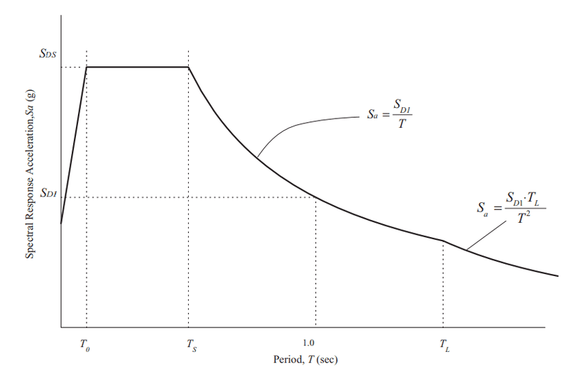</div>
          <div class="chapter-card-content">
            <span class="chapter-tag">Volumen 2021 · Capítulo 1</span>
            <h4 class="chapter-title">Actualización de los coeficientes sísmicos de diseño estructural para la Norma Colombiana de Construcción Sismo Resistente NSR-22</h4>
          </div>
        </a>
        <!-- Card Capítulo 2 -->
        <a href="https://scr-ungrd.github.io/investigaciones-grd-2021/02-capitulo-2-mitigacion-del-riesgo-sismico-de-l.html" target="_blank" class="chapter-card">
          <div class="chapter-card-image">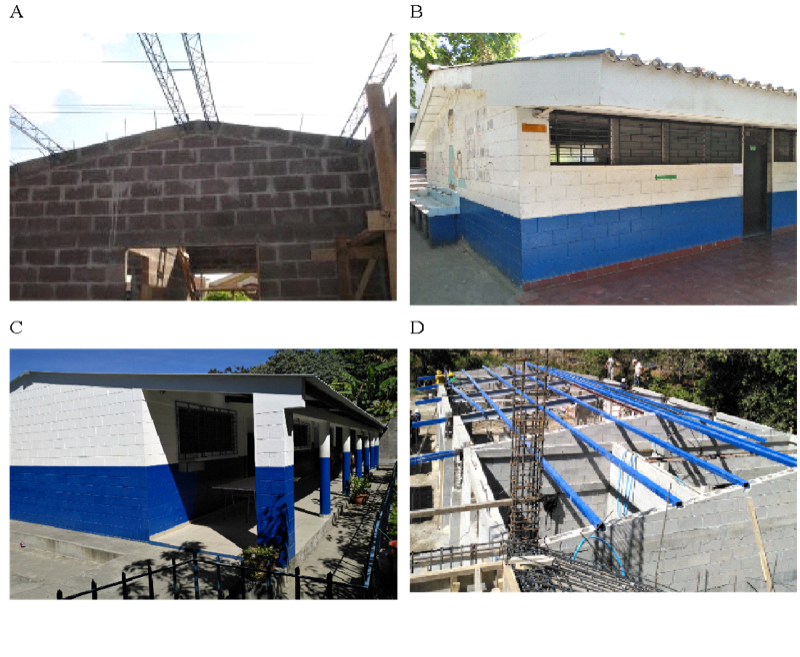</div>
          <div class="chapter-card-content">
            <span class="chapter-tag">Volumen 2021 · Capítulo 2</span>
            <h4 class="chapter-title">Mitigación del riesgo sísmico de la infraestructura escolar</h4>
          </div>
        </a>
        <!-- Card Capítulo 3 -->
        <a href="https://scr-ungrd.github.io/investigaciones-grd-2021/03-capitulo-3-evaluacion-probabilista-del-riesgo.html" target="_blank" class="chapter-card">
          <div class="chapter-card-image">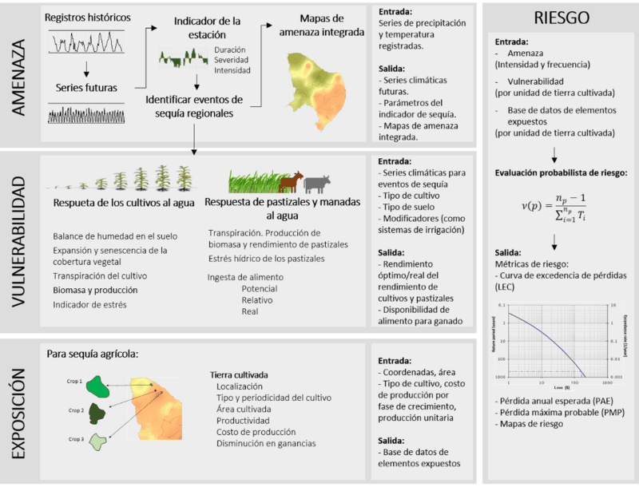</div>
          <div class="chapter-card-content">
            <span class="chapter-tag">Volumen 2021 · Capítulo 3</span>
            <h4 class="chapter-title">Evaluación probabilista del riesgo por sequía en el sector agrícola de Colombia</h4>
          </div>
        </a>
        <!-- Card Capítulo 4 -->
        <a href="https://scr-ungrd.github.io/investigaciones-grd-2021/04-capitulo-4-contribucion-de-la-geodesia-espaci.html" target="_blank" class="chapter-card">
          <div class="chapter-card-image">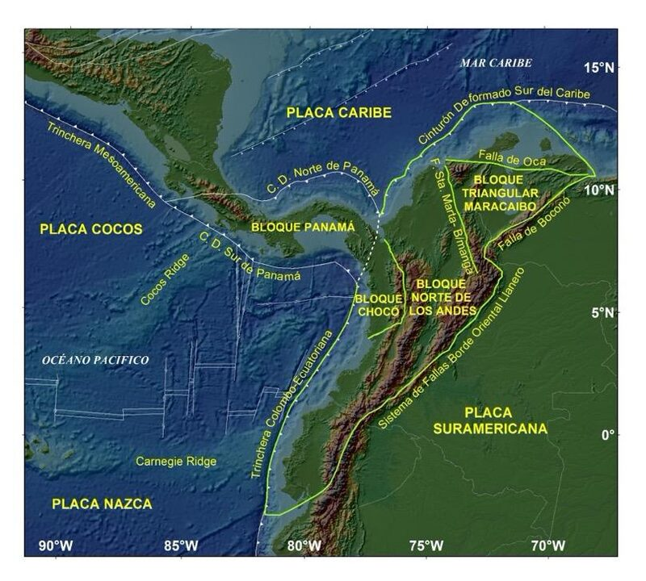</div>
          <div class="chapter-card-content">
            <span class="chapter-tag">Volumen 2021 · Capítulo 4</span>
            <h4 class="chapter-title">Contribución de la geodesia espacial en la gestión del riesgo en Colombia. Casos de estudio</h4>
          </div>
        </a>
        <!-- Card Capítulo 5 -->
        <a href="https://scr-ungrd.github.io/investigaciones-grd-2021/05-capitulo-5-nociones-performativas-del-reasent.html" target="_blank" class="chapter-card">
          <div class="chapter-card-image"></div>
          <div class="chapter-card-content">
            <span class="chapter-tag">Volumen 2021 · Capítulo 5</span>
            <h4 class="chapter-title">Nociones performativas del reasentamiento social por riesgo de desastre en Colombia: componentes psicosociales estratégicos para la sostenibilidad</h4>
          </div>
        </a>
        <!-- Card Capítulo 6 -->
        <a href="https://scr-ungrd.github.io/investigaciones-grd-2021/06-capitulo-6-animales-en-la-gestion-del-riesgo-.html" target="_blank" class="chapter-card">
          <div class="chapter-card-image"></div>
          <div class="chapter-card-content">
            <span class="chapter-tag">Volumen 2021 · Capítulo 6</span>
            <h4 class="chapter-title">Animales en la gestión del riesgo de los desastres</h4>
          </div>
        </a>
        <!-- Card Capítulo 7 -->
        <a href="https://scr-ungrd.github.io/investigaciones-grd-2021/07-capitulo-7-iniciativas-para-la-reduccion-del-.html" target="_blank" class="chapter-card">
          <div class="chapter-card-image">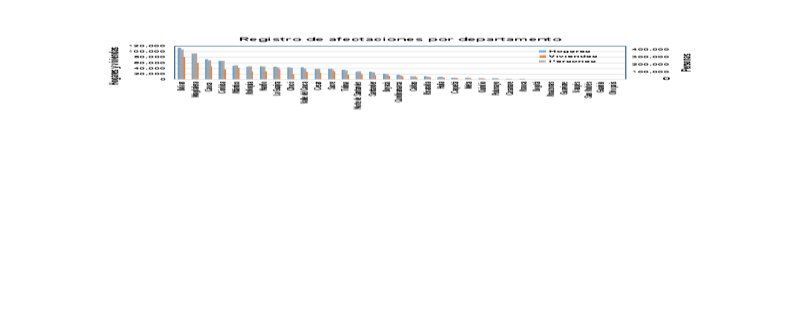</div>
          <div class="chapter-card-content">
            <span class="chapter-tag">Volumen 2021 · Capítulo 7</span>
            <h4 class="chapter-title">Iniciativas para la reducción del riesgo de desastres en el programa de Ingeniería Ambiental y Sanitaria de la Universidad de La Salle: un tema de responsabilidad social universitaria</h4>
          </div>
        </a>
        <!-- Card Capítulo 8 -->
        <a href="https://scr-ungrd.github.io/investigaciones-grd-2021/08-capitulo-8-comunicacion-del-riesgo-reflexione.html" target="_blank" class="chapter-card">
          <div class="chapter-card-image">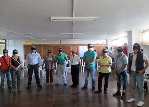</div>
          <div class="chapter-card-content">
            <span class="chapter-tag">Volumen 2021 · Capítulo 8</span>
            <h4 class="chapter-title">Comunicación del riesgo: reflexiones y experiencias locales en el departamento del Valle del Cauca</h4>
          </div>
        </a>
        <!-- Card Capítulo 9 -->
        <a href="https://scr-ungrd.github.io/investigaciones-grd-2021/09-capitulo-9-la-perspectiva-historica-en-la-ges.html" target="_blank" class="chapter-card">
          <div class="chapter-card-image">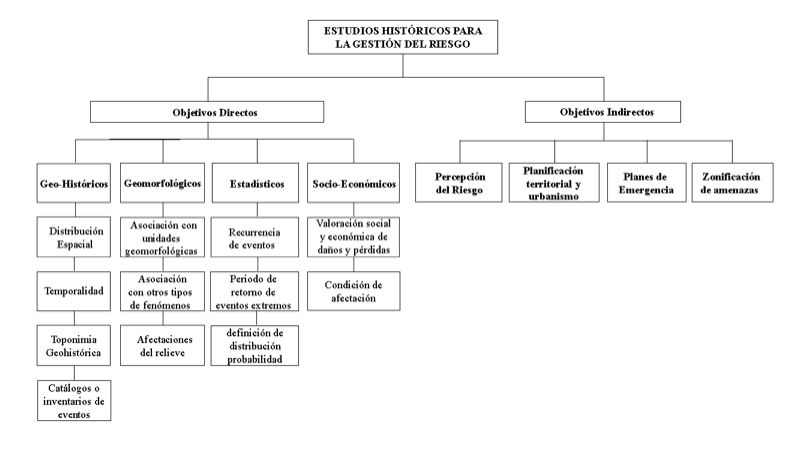</div>
          <div class="chapter-card-content">
            <span class="chapter-tag">Volumen 2021 · Capítulo 9</span>
            <h4 class="chapter-title">La perspectiva histórica en la gestión del riesgo de desastres: aplicación en Santiago de Cali, Colombia</h4>
          </div>
        </a>
        <!-- Card Capítulo 10 -->
        <a href="https://scr-ungrd.github.io/investigaciones-grd-2021/10-capitulo-10-estudio-de-riesgo-por-movimientos.html" target="_blank" class="chapter-card">
          <div class="chapter-card-image">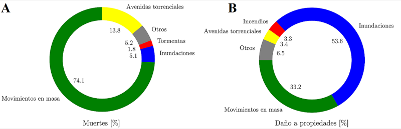</div>
          <div class="chapter-card-content">
            <span class="chapter-tag">Volumen 2021 · Capítulo 10</span>
            <h4 class="chapter-title">Estudio de riesgo por movimientos en masa en cuencas hidrográficas abastecedoras en el suroeste antioqueño usando métodos probabilistas</h4>
          </div>
        </a>
        <!-- Card Capítulo 11 -->
        <a href="https://scr-ungrd.github.io/investigaciones-grd-2021/11-capitulo-11-de-la-percepcion-de-la-amenaza-a-.html" target="_blank" class="chapter-card">
          <div class="chapter-card-image">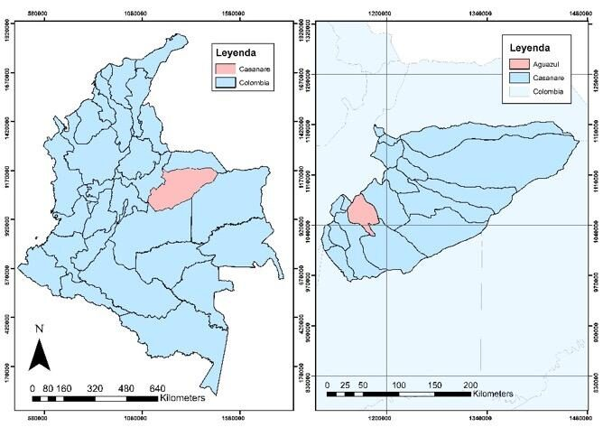</div>
          <div class="chapter-card-content">
            <span class="chapter-tag">Volumen 2021 · Capítulo 11</span>
            <h4 class="chapter-title">De la percepción de la amenaza a su cuantificación. Caso de estudio: desbordamiento del río Unete en Aguazul, Casanare, Colombia</h4>
          </div>
        </a>
        <!-- Card Capítulo 12 -->
        <a href="https://scr-ungrd.github.io/investigaciones-grd-2021/12-capitulo-12-obras-costeras-y-clima-maritimo-c.html" target="_blank" class="chapter-card">
          <div class="chapter-card-image">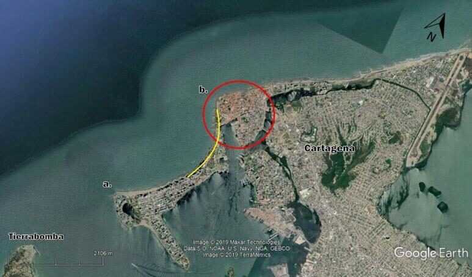</div>
          <div class="chapter-card-content">
            <span class="chapter-tag">Volumen 2021 · Capítulo 12</span>
            <h4 class="chapter-title">Obras costeras y clima marítimo: casos del Caribe colombiano</h4>
          </div>
        </a>
        <!-- Card Capítulo 13 -->
        <a href="https://scr-ungrd.github.io/investigaciones-grd-2021/13-capitulo-13-modelo-de-gestion-y-analisis-del-.html" target="_blank" class="chapter-card">
          <div class="chapter-card-image">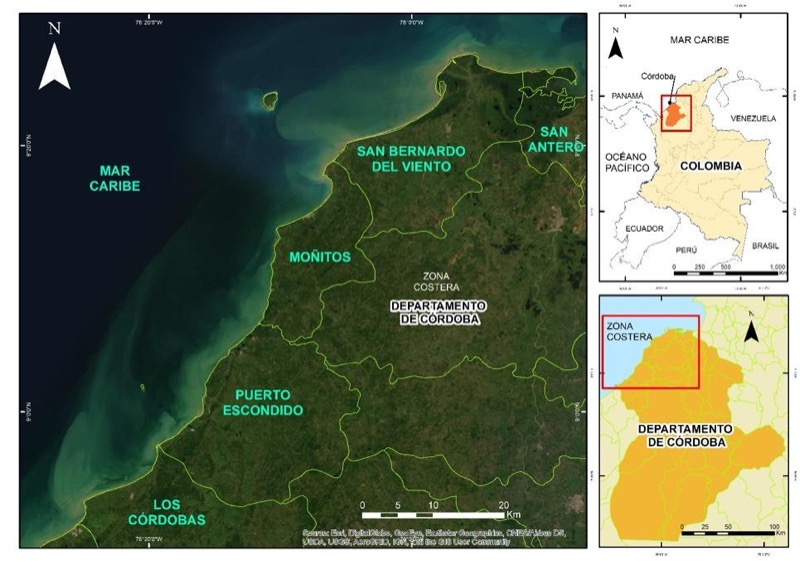</div>
          <div class="chapter-card-content">
            <span class="chapter-tag">Volumen 2021 · Capítulo 13</span>
            <h4 class="chapter-title">Modelo de gestión y análisis del riesgo por erosión costera. Caso de estudio departamento de Córdoba</h4>
          </div>
        </a>
        <!-- Card Capítulo 14 -->
        <a href="https://scr-ungrd.github.io/investigaciones-grd-2021/14-capitulo-14-gestion-del-riesgo-por-inundacion.html" target="_blank" class="chapter-card">
          <div class="chapter-card-image">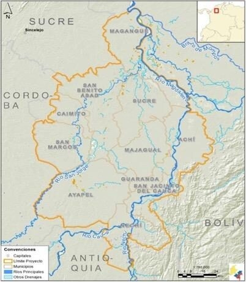</div>
          <div class="chapter-card-content">
            <span class="chapter-tag">Volumen 2021 · Capítulo 14</span>
            <h4 class="chapter-title">Gestión del riesgo por inundaciones: un metamodelo para el desarrollo de artefactos participativos. Caso de estudio en la ecorregión de La Mojana (Colombia)</h4>
          </div>
        </a>
      </div>
    </div>
  </div>
</section>

<!-- ══════════════════════════════════════════════════════
     OTRAS PUBLICACIONES
     ══════════════════════════════════════════════════════ -->
<section id="otras" class="other-pubs-section">
  <div class="chapters-container">
    <div class="section-header">
      <h2 class="section-title">Otras Publicaciones</h2>
      <div class="section-divider"></div>
    </div>
    
    <div class="other-pubs-content">
      <a href="https://scr-ungrd.github.io/memorias-idrim-2024-colombia/" target="_blank" class="other-pub-link">
        <div class="other-pub-visual">
          
        </div>
        <div class="other-pub-text">
          <span class="other-pub-badge">Memorias de Evento</span>
          <h3 class="other-pub-title">IDRIM 2024</h3>
          <p class="other-pub-desc">
            14° Conferencia Internacional sobre Gestión Integrada del Riesgo de Desastres. Bogotá, Colombia, agosto 2024.
          </p>
        </div>
      </a>
    </div>
  </div>
</section>
```